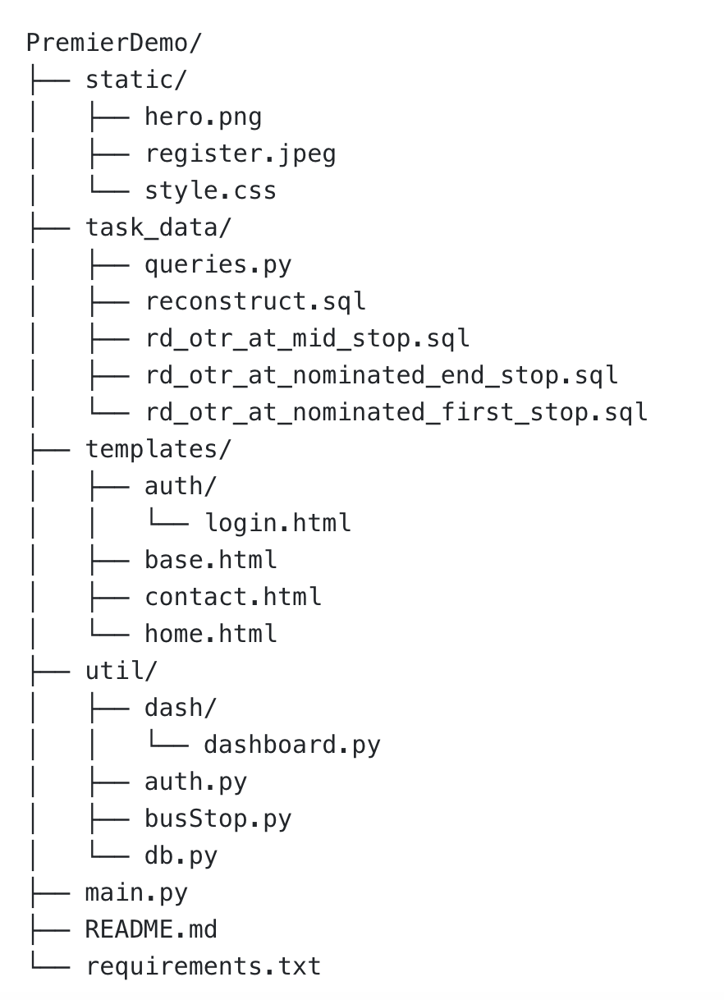

**This is a full-stack project demo for Premier**
# Table of contents
1. [Usage](#1)
2. [Directory tree](#2)
3. [Approach Explanation](#3)
4. [Tech stack](#4)
5. [Project Constrain](#5)
6. [Future development](#6)

# Usage {#1}
## Prerequisites
This project is built with Python. Use the following commands to set up a virtual environment. (For Windows OS, replace `python3` and `pip3` with `python` and `pip`.)
> python3 -m venv venv
> source venv/bin/activate
> pip3 install -r requirements.txt

## Environmen variables
If you are running this project locally, create a `.env` file at the root for these variables. Your host provider should included a feature to set them there directly to avoid exposing them.

Here are the required ones:
> DB_NAME = 
> DB_USER = 
> DB_PASSWORD = 
> DB_HOST = 
> SECRET_KEY= (you can use any make up string, or simply use 'dev')

## Set up database
To ensure the project retrieves data correctly, please update the database by executing the `reconstruct.sql` file.
The demo database name is **"PremierDemo"**, if you're using different name, please modify the sql query.

## Run the porject
Run this command and the web app should run at local host 5000.
> flask --app main run

## Credential for log in
Use this credential pair for demo log in:
> email: admin01@example.com
> pasword: admin1234


# Directory tree {#2}

PremierDemo/
├── static/
│   ├── hero.png
│   ├── register.jpeg
│   └── style.css
├── task_data/
│   ├── queries.py
│   ├── reconstruct.sql
│   ├── rd_otr_at_mid_stop.sql
│   ├── rd_otr_at_nominated_end_stop.sql
│   └── rd_otr_at_nominated_first_stop.sql
├── templates/
│   ├── auth/
│   │   └── login.html
│   ├── base.html
│   ├── contact.html
│   └── home.html
├── util/
│   ├── dash/
│   │   └── dashboard.py
│   ├── auth.py
│   ├── busStop.py
│   └── db.py
├── main.py
├── README.md
└── requirements.txt

```
# Approach Explanation {#3}
I develop the web application based on two scenarios assumption.
### User story one: General public user (Amy)
> Amy is a student living in the Illawarra area who relies on public transport to get around. She wants to check the general information for a bus route at a specific stop, including the earliest and latest buses she can catch and the route details (start, mid, and end stops).
#### Front end
To fulfill Amy’s needs (and for most general public users), I designed the homepage to focus on a stop search feature. Users can enter a stop name, and the web app will display a list of relevant routes (regular only) with key information, such as:
	•	Earliest and latest start times for the route
	•	Start, mid, and end stops of the route
	•	The bus operator responsible for the route
This search feature is deisgned to handle partial matches so that users can still retrieve results even if they don't remember the full stop name.

#### Backend and database
To optimize query performance and enhance user experience, I created a custom table (busRoute) that stores only relevant and frequently queried data. This improves response time by reducing the need to join large tables during user queries.

Additionally, I implemented a fuzzy search mechanism by using LOWER() and REPLACE() functions in SQL queries. This ensures users can perform case-insensitive and whitespace-tolerant searches, making the application more user-friendly. 


### User story two: Internal staff user (Bob)
> Bob is a staff member at Premier, responsible for monitoring the performance of bus operations. He wants to access operational performance metrics through the web application.
To meet Bob’s requirements, I built a secure dashboard page that displays key performance metrics, including:
	•	Overall on-time rate
	•	Total trips completed
	•	Average delay times

The dashboard is protected by a login system to ensure that only authorized users (e.g., Premier staff) can access sensitive operational data.


# Tech Stacks {#4}
The project utilises the following technologies:
	•	Frontend: HTML, CSS, JavaScript, Dash, Bootstrap
	•	Backend: Python Flask, SQLAlchemy, Pandas
	•	Database: MariaDB, SQL


# Project Constrain {#5}
1. **Database constrain:** Due to limitations with my personal device, I used MariaDB instead of SQL Server. However, all queries are compatible with standard SQL, and a version of the queries for SQL Server is also included in the project files.
2. **Business understanding constrain:** Some data columns and business rules are based on personal assumptions and may not fully align with real-world operations at Premier. Further input from business stakeholders would be needed to fine-tune the data structure and metrics.
3. **Time and creativity constrain:** The frontend design is currently minimalist due to time constraints. With more time, I would improve the UI/UX by adding:
	•	A more visually appealing dashboard
	•	User-friendly data filters and search suggestions


# Future Development {#6}
1. **Database optimisation:** The current database could be restructured to use more atomic schemas (e.g., separating route, stop, and trip data into normalized tables). This would enhance data processing efficiency and make it easier to scale.
2. **Advanced search features:** 	
    •	Implement autocomplete suggestions for the stop search feature to improve user experience.
	•	Use geolocation-based search to allow users to find stops near their current location.
	•	Integrate with TransportNSW with trip planner.
3. **Security layer enhancement:** Consider adding role-based access control (RBAC) in future iterations.


